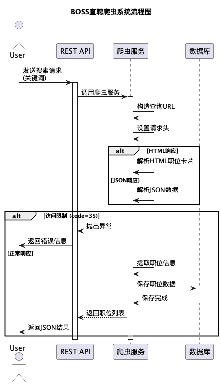

<div align="center">
  
  <h1>BOSS 直聘爬虫</h1>
  <p>
    
    
    
    
    
  </p>
  <p>
    <a href="#功能特点">功能</a> •
    <a href="#安装方法">安装</a> •
    <a href="#使用方法">使用</a> •
    <a href="#系统架构">架构</a> •
    <a href="#免责声明">免责声明</a>
  </p>
</div>


基于 Spring Boot 的 BOSS 直聘职位信息爬虫系统，提供自动化的职位信息采集和数据处理功能。系统采用现代化的技术栈，包括 Spring Boot 框架、SQLite 数据库和 RESTful API 设计，实现了智能的反爬虫策略和高效的数据解析能力。该系统可以帮助求职者和 HR 快速获取 BOSS 直聘平台的职位信息，支持关键词搜索，并将数据以结构化的方式存储，便于后续分析和使用。


## 功能特点

- 支持关键词搜索职位信息
- 自动解析职位详情数据
- REST API接口支持
- SQLite本地数据存储
- 智能反爬虫处理

## 系统要求

| 组件        | 版本要求 |
| ----------- | -------- |
| Java        | 11+      |
| Maven       | 3.9.6+   |
| Spring Boot | 2.7.18   |
| SQLite      | 3.x      |


## 快速开始

1. 克隆项目
```bash
git clone https://github.com/ctkqiang/boss_zhipin_pachong.git
````

2. 编译运行

```bash
cd boss_zhipin_pachong
mvn spring-boot:run
```

3. 访问 API

```bash
curl "http://localhost:8080/api/jobs?keyword=Java"
```

## API 文档

### 获取职位列表

**请求信息：**

- 方法：`GET`
- 路径：`/api/jobs`
- Content-Type: `application/json`

**请求参数：**
| 参数名 | 类型 | 必填 | 说明 | 示例 |
|--------|------|------|------|------|
| keyword | String | 是 | 职位搜索关键词 | "Java 开发" |

**响应格式：**

```json
{
  "code": 0,
  "message": "success",
  "data": [
    {
      "title": "高级Java开发工程师",
      "company": "阿里巴巴",
      "salary": "25-35K",
      "location": "杭州",
      "experience": "3-5年",
      "skills": ["Java", "Spring Boot", "MySQL"]
    }
  ]
}
```


## 数据库结构

职位表(jobs):

| 字段名     | 类型      | 说明     | 约束                      |
| ---------- | --------- | -------- | ------------------------- |
| id         | INTEGER   | 自增主键 | PRIMARY KEY AUTOINCREMENT |
| title      | TEXT      | 职位名称 | NOT NULL                  |
| company    | TEXT      | 公司名称 | NOT NULL                  |
| salary     | TEXT      | 薪资范围 | -                         |
| location   | TEXT      | 工作地点 | -                         |
| experience | TEXT      | 经验要求 | -                         |
| skills     | TEXT      | 技能要求 | -                         |
| created_at | TIMESTAMP | 创建时间 | DEFAULT CURRENT_TIMESTAMP |


## 算法




## 注意事项

- 请合理控制爬取频率，避免对目标网站造成压力
- 仅用于学习和研究目的，请勿用于商业用途
- 遵守目标网站的 robots.txt 规则


## 许可证

本项目采用 **木兰宽松许可证 (Mulan PSL)** 进行许可。  
有关详细信息，请参阅 [LICENSE](LICENSE) 文件。

[](http://license.coscl.org.cn/MulanPSL2)


## 🌟 开源项目赞助计划

### 用捐赠助力发展

感谢您使用本项目！您的支持是开源持续发展的核心动力。  
每一份捐赠都将直接用于：  
✅ 服务器与基础设施维护  
✅ 新功能开发与版本迭代  
✅ 文档优化与社区建设

点滴支持皆能汇聚成海，让我们共同打造更强大的开源工具！

---

### 🌐 全球捐赠通道

#### 国内用户

<div align="center" style="margin: 40px 0">

<div align="center">
<table>
<tr>
<td align="center" width="300">

<br />
<strong>🔵 支付宝</strong>
</td>
<td align="center" width="300">

<br />
<strong>🟢 微信支付</strong>
</td>
</tr>
</table>
</div>
</div>

#### 国际用户

<div align="center" style="margin: 40px 0">
  <a href="https://qr.alipay.com/fkx19369scgxdrkv8mxso92" target="_blank">
    
  </a>
  
  <a href="https://ko-fi.com/F1F5VCZJU" target="_blank">
    
  </a>
  
  <a href="https://www.paypal.com/paypalme/ctkqiang" target="_blank">
    
  </a>
  
  <a href="https://donate.stripe.com/00gg2nefu6TK1LqeUY" target="_blank">
    
  </a>
</div>

---

### 📌 开发者社交图谱

#### 技术交流

<div align="center" style="margin: 20px 0">
  <a href="https://github.com/ctkqiang" target="_blank">
    
  </a>
  
  <a href="https://stackoverflow.com/users/10758321/%e9%92%9f%e6%99%ba%e5%bc%ba" target="_blank">
    
  </a>
  
  <a href="https://www.linkedin.com/in/ctkqiang/" target="_blank">
    
  </a>
</div>

#### 社交互动

<div align="center" style="margin: 20px 0">
  <a href="https://www.instagram.com/ctkqiang" target="_blank">
    
  </a>
  
  <a href="https://twitch.tv/ctkqiang" target="_blank">
    
  </a>
  
  <a href="https://github.com/ctkqiang/ctkqiang/blob/main/assets/IMG_9245.JPG?raw=true" target="_blank">
    
  </a>
</div>

---

🙌 感谢您成为开源社区的重要一员！  
💬 捐赠后欢迎通过社交平台与我联系，您的名字将出现在项目致谢列表！
